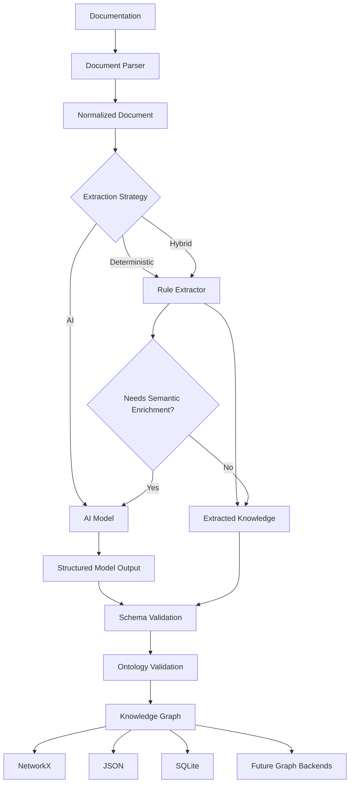

# DocGraph

**Python-first knowledge graphs for your documentation.**

Turn Markdown and other documentation into a structured, validated, and queryable knowledge graph — with **AI as an optional capability, not a requirement**.

**Status:** 🚧 Alpha

> **Documentation → Knowledge → Graph**

---

## What is DocGraph?

DocGraph is an open-source framework for turning documentation into a **structured knowledge graph**.

Engineering knowledge is often distributed across:

* Architecture documents
* Markdown files
* APIs
* Microservices
* Databases
* Events
* Queues and topics
* Requirements
* Design documents
* Runbooks
* Technical specifications

Humans can understand this information, but machines often struggle to understand how the different pieces are connected.

DocGraph makes those relationships explicit.

For example:

```text
Order Service
      │
      ├── DEPENDS_ON ──→ PostgreSQL
      │
      ├── DEPENDS_ON ──→ Payment Service
      │
      ├── PUBLISHES ──→ OrderCreatedEvent
      │
      └── CONSUMES ──→ PaymentCompletedEvent
```

The goal is simple:

> **Make documentation machine-readable without making it machine-dependent.**

---

# Why DocGraph?

Many knowledge graph approaches start with:

```text
Document
    ↓
LLM
    ↓
Knowledge Graph
```

DocGraph takes a different approach:

```text
Document
    ↓
Parser
    ↓
Deterministic Extraction
    ↓
Schema Validation
    ↓
Knowledge Graph
```

When deterministic extraction is not enough:

```text
Ambiguous Content
       ↓
Optional AI Model
       ↓
Structured Output
       ↓
Validation
       ↓
Knowledge Graph
```

This provides:

* ⚡ Fast deterministic processing
* 💰 No AI/API cost for structured content
* 🔒 No mandatory external model dependency
* 🔁 Reproducible graph generation
* ✅ Schema and ontology validation
* 🤖 Optional AI-powered semantic extraction
* 🧩 Pluggable model providers
* 📚 Git-friendly source documentation
* 🛠️ Developer-friendly Python APIs

---

# Design Philosophy

## 🐍 Python First

DocGraph is designed as a Python framework.

Use it from Python:

```python
from docgraph import ...
```

or from the command line:

```bash
docgraph build
```

---

## ⚡ Deterministic First

Structured documentation should not require an LLM.

For example:

```markdown
## Depends On

- PostgreSQL
- Payment Service
```

can be converted directly into:

```text
Order Service
    ├── DEPENDS_ON → PostgreSQL
    └── DEPENDS_ON → Payment Service
```

No model is required.

---

## 🤖 AI Optional

AI becomes useful when relationships are implicit or difficult to determine using rules.

For example:

```text
"The order system sends payment information
to the payment platform after an order is created."
```

A model could identify:

```text
Order Service
       │
       └── SENDS_DATA_TO → Payment Service
```

However, model output is **never trusted blindly**.

The model pipeline is:

```text
Model
  ↓
Structured Output
  ↓
Schema Validation
  ↓
Ontology Validation
  ↓
Knowledge Graph
```

---

## 🧩 Model Independent

DocGraph should not be tied to a specific AI provider.

The model layer provides an abstraction:

```text
                  Model
                    │
        ┌───────────┼───────────┐
        │           │           │
      OpenAI      Ollama      Custom
```

Additional providers can be added without changing the core graph engine.

---

# Architecture



DocGraph separates the core pipeline into independent layers:

```text
Parser
   ↓
Extractor
   ↓
Validator
   ↓
Graph
   ↓
Storage / Visualization
```

AI is an extension of the extraction layer rather than a dependency of the framework.

---

# Quick Start

> ⚠️ DocGraph is currently in alpha. Installation and APIs may change.

## 1. Create a project

```bash
mkdir my-docgraph
cd my-docgraph
```

Initialize the project:

```bash
docgraph init
```

This creates:

```text
my-docgraph/
│
├── docgraph.yaml
├── ontology.yaml
└── docs/
```

---

## 2. Add documentation

Create:

```text
docs/order-service.md
```

Example:

```markdown
---
type: service
id: order-service
name: Order Service
owner: commerce-platform
---

# Order Service

## Description

Responsible for creating and managing customer orders.

## Depends On

- PostgreSQL
- Payment Service

## Publishes

- OrderCreatedEvent
- OrderCancelledEvent

## Consumes

- PaymentCompletedEvent

## APIs

- POST /v1/orders
- GET /v1/orders/{orderId}
```

---

## 3. Build the graph

```bash
docgraph build
```

Example output:

```text
DocGraph

Scanning documentation...

✓ 12 documents parsed
✓ 34 entities discovered
✓ 58 relationships discovered
✓ 0 validation errors

Knowledge graph generated.

Nodes: 34
Edges: 58

Output:
./output/graph.json
```

---

## 4. Validate

```bash
docgraph validate
```

Example:

```text
Validating documentation...

✓ Entity definitions
✓ Relationship types
✓ Entity references
✓ Ontology constraints

No validation errors found.
```

---

## 5. View graph statistics

```bash
docgraph stats
```

Example:

```text
Knowledge Graph Statistics

Documents       12
Entities        34
Relationships   58

Entity Types

Service         10
Database         4
Event           15
API              5

Relationships

DEPENDS_ON      21
PUBLISHES       14
CONSUMES        17
STORES_IN        6
```

---

## 6. Agent integration setup (context retrieval)

Use DocGraph as a local retrieval index for your AI agent.

Prerequisites:

* Python virtual environment with project dependencies installed
* `docgraph.yaml` configured with valid `source.path`, `ontology.path`, and `output.path`
* Graph built at least once

Build and inspect:

```bash
docgraph build -c docgraph.yaml
docgraph stats -c docgraph.yaml
```

With the default starter config, the graph is written to:

```text
./output/graph.json
```

Recommended runtime flow for an AI agent:

1. Load `./output/graph.json` at startup (or cache it with a reload strategy).
2. For each user query, match relevant nodes by `id`, `name`, `type`, and text fields.
3. Expand 1-2 hop neighbors through edges to collect related context.
4. Rank and cap results (for example top 10 nodes, top 20 edges).
5. Send only that compact subgraph to the LLM as grounded context.

Example context payload shape:

```json
{
  "query": "Which services consume PaymentCompletedEvent?",
  "matched_node_ids": ["payment-completed-event"],
  "context_nodes": [
    {"id": "order-service", "type": "service", "name": "Order Service"},
    {"id": "payment-completed-event", "type": "event", "name": "PaymentCompletedEvent"}
  ],
  "context_edges": [
    {"source": "order-service", "relation": "CONSUMES", "target": "payment-completed-event", "confidence": 1.0}
  ]
}
```

This keeps prompts small and makes answers traceable to graph evidence instead of ungrounded guesses.

---

# Documentation Format

DocGraph uses Markdown as a human-friendly source format.

A document can define metadata using YAML frontmatter:

```markdown
---
type: service
id: order-service
name: Order Service
owner: commerce-platform
---
```

The body describes the component:

```markdown
# Order Service

## Description

Responsible for creating and managing customer orders.

## Depends On

- PostgreSQL
- Payment Service

## APIs

- POST /v1/orders
- GET /v1/orders/{orderId}

## Publishes

- OrderCreatedEvent

## Consumes

- PaymentCompletedEvent
```

The documentation remains useful to humans while providing structured information to DocGraph.

---

# Explicit Relationships

DocGraph can also support explicit references:

```markdown
## Dependencies

- [[PostgreSQL]]
- [[Payment Service]]
```

This allows relationships to be represented directly in Markdown.

For example:

```text
Order Service
      │
      ├──→ PostgreSQL
      └──→ Payment Service
```

---

# Ontology

The ontology defines the entities and relationships that are valid within a graph.

Example:

```yaml
entities:

  service:
    description: Software service or microservice

  database:
    description: Persistent data store

  event:
    description: Domain or integration event

  api:
    description: API endpoint

relationships:

  DEPENDS_ON:
    source: service
    target:
      - service
      - database

  PUBLISHES:
    source: service
    target: event

  CONSUMES:
    source: service
    target: event

  STORES_IN:
    source: service
    target: database
```

The ontology prevents invalid relationships from silently entering the graph.

For example:

```text
Order Service
    ──PUBLISHES──→ PostgreSQL
```

would be rejected if `PUBLISHES` only allows an `event` as its target.

---

# Knowledge Graph Model

DocGraph is built around two fundamental concepts.

## Entity

```json
{
  "id": "order-service",
  "type": "service",
  "name": "Order Service"
}
```

## Relationship

```json
{
  "source": "order-service",
  "relation": "DEPENDS_ON",
  "target": "postgresql",
  "confidence": 1.0
}
```

Relationships include a confidence value.

Deterministic extraction:

```text
confidence = 1.0
```

Model-based extraction:

```text
confidence = model-derived value
```

---

# AI / Model Support

AI is an optional extension.

The core package works without an AI model or API key.

The architecture is:

```text
                   DocGraph
                      │
              Extraction Layer
                      │
          ┌───────────┴───────────┐
          │                       │
    Rule Extractor          Model Extractor
          │                       │
    Deterministic          Semantic extraction
          │                       │
          └───────────┬───────────┘
                      │
                  Validation
                      │
                      ▼
                Knowledge Graph
```

Optional model providers may include:

* OpenAI
* Ollama
* Local models
* Custom providers

The provider implementation should remain isolated from the core framework.

---

# Graph Backends

The graph layer is abstracted from the underlying implementation.

### Current

```text
NetworkX
```

### Planned

```text
NetworkX
SQLite
Neo4j
Other graph databases
```

The goal is:

```text
                    Graph API
                       │
             ┌─────────┼─────────┐
             │         │         │
         NetworkX    SQLite    Neo4j
```

The extraction pipeline should not need to know which graph backend is being used.

---

# CLI

Current commands:

| Command             | Description                              |
| ------------------- | ---------------------------------------- |
| `docgraph init`     | Initialize a DocGraph project            |
| `docgraph build`    | Build the knowledge graph                |
| `docgraph validate` | Validate documentation and relationships |
| `docgraph stats`    | Display graph statistics                 |

Planned commands:

| Command              | Description                       |
| -------------------- | --------------------------------- |
| `docgraph visualize` | Generate a graph visualization    |
| `docgraph query`     | Query the knowledge graph         |
| `docgraph impact`    | Analyze dependency impact         |
| `docgraph export`    | Export to different graph formats |

---

# Example Use Cases

## 🏗️ Software Architecture

Understand relationships between:

```text
Service
   ↓
Dependencies
   ↓
Database
   ↓
Events
   ↓
Consumers
```

---

## 🔌 API Documentation

Connect:

```text
Service
   ↓
API
   ↓
Request
   ↓
Response
```

---

## 📨 Event-Driven Systems

Represent:

```text
Producer
   ↓
Event
   ↓
Queue / Topic
   ↓
Consumer
```

---

## 📋 Requirements Traceability

Connect:

```text
Requirement
      ↓
Feature
      ↓
Component
      ↓
Service
      ↓
API
```

---

## 🔍 Architecture Impact Analysis

Once the graph is available, you can answer questions such as:

```text
What services depend on PostgreSQL?

Which services consume PaymentCompletedEvent?

What components are affected if Payment Service changes?

Which APIs belong to Order Service?

Which services publish OrderCreatedEvent?

What components implement this requirement?
```

---

# Project Structure

```text
docgraph/
│
├── README.md
├── LICENSE
├── CONTRIBUTING.md
├── pyproject.toml
│
├── docs/
│   ├── architecture.md
│   ├── concepts.md
│   ├── ontology.md
│   ├── configuration.md
│   └── examples/
│
├── examples/
│   ├── basic/
│   └── e-commerce/
│
├── src/
│   └── docgraph/
│       ├── core/
│       ├── parser/
│       ├── extraction/
│       ├── models/
│       ├── validation/
│       ├── storage/
│       └── visualization/
│
└── tests/
```

---

# Development

Clone the repository:

```bash
git clone https://github.com/nitesh-sharma-01/docgraph.git
cd docgraph
```

Create a virtual environment:

```bash
python -m venv .venv
```

Activate it:

### macOS / Linux

```bash
source .venv/bin/activate
```

### Windows

```powershell
.venv\Scripts\activate
```

Install in editable mode:

```bash
pip install -e .
```

Run tests:

```bash
pytest
```

---

# Roadmap

## Phase 1 — Core

* [ ] Project scaffolding
* [ ] Markdown parser
* [ ] YAML frontmatter
* [ ] Entity model
* [ ] Relationship model
* [ ] Ontology
* [ ] Rule-based extraction
* [ ] Schema validation
* [ ] NetworkX graph
* [ ] JSON export
* [ ] CLI
* [ ] Unit tests

## Phase 2 — AI Extensions

* [ ] Model abstraction
* [ ] OpenAI provider
* [ ] Ollama provider
* [ ] Structured model extraction
* [ ] Confidence scoring
* [ ] AI fallback strategy
* [ ] Model response validation

## Phase 3 — Graph Intelligence

* [ ] Graph queries
* [ ] Dependency analysis
* [ ] Impact analysis
* [ ] Interactive visualization
* [ ] Graph statistics
* [ ] SQLite backend

## Phase 4 — Advanced Integrations

* [ ] Neo4j adapter
* [ ] Additional document formats
* [ ] Semantic search
* [ ] MCP integration
* [ ] Web UI
* [ ] Plugin architecture

---

# What DocGraph Is Not

DocGraph is **not** intended to be:

* An LLM wrapper
* A chatbot framework
* A RAG framework
* A replacement for documentation
* A framework tied to a single AI provider
* A system that requires AI to function

Instead:

> **DocGraph is a documentation-to-knowledge-graph framework where AI is an optional extension.**

---

# Contributing

Contributions are welcome.

Areas where contributions will be particularly useful:

* 📄 Document parsers
* 🔎 Extraction strategies
* 🧠 Ontologies
* 🤖 Model providers
* 🗄️ Graph backends
* 📊 Visualization
* 🛠️ CLI improvements
* 🧪 Tests
* 📚 Documentation
* 💡 Architecture templates

Please see [CONTRIBUTING.md](CONTRIBUTING.md) before submitting a pull request.

---

# Project Status

🚧 **Alpha Software**

DocGraph is currently in early development.

The API, CLI, configuration format, and internal architecture may change as the project evolves.

The current focus is establishing a clean, lightweight, and extensible foundation before adding advanced AI and graph capabilities.

---

# Vision

Documentation should not only explain a system to humans.

It should also provide machines with a structured understanding of the system.

```text
What exists?
      ↓
How is it connected?
      ↓
Who owns it?
      ↓
What depends on it?
      ↓
What happens when it changes?
```

DocGraph aims to make that knowledge:

**Human-readable → Machine-readable → Queryable → Version-controlled**

---

# Maintainer

Created and maintained by **Nitesh Sharma**.

GitHub: [@nitesh-sharma-01](https://github.com/nitesh-sharma-01)

---

# License

This project is licensed under the MIT License.

See [LICENSE](LICENSE) for details.

---

**DocGraph**

> **Documentation → Knowledge → Graph**
