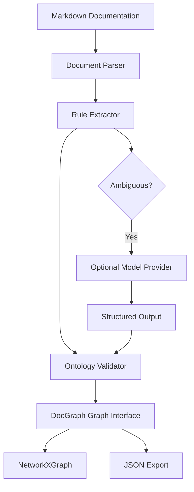

# Architecture

DocGraph separates parsing, extraction, validation, graph construction, and
storage. The deterministic path is the default.

## Layers

Parser:
Turns source content into a neutral `Document` model with frontmatter, sections,
lists, links, paragraphs, and code blocks.

Extraction:
Turns a `Document` into candidate `Entity` and `Relationship` models.

Validation:
Checks candidate data against an ontology before graph insertion.

Graph:
Provides a storage-neutral API. `NetworkXGraph` is the initial implementation.

Storage:
Exports the graph to deterministic JSON. SQLite and other stores can be added
behind dedicated adapters later.

## AI Boundary

Model providers are optional adapters. `ModelExtractor` accepts a provider,
requires structured JSON, validates it with Pydantic, and then relies on the
ontology validator before anything is added to a graph.
